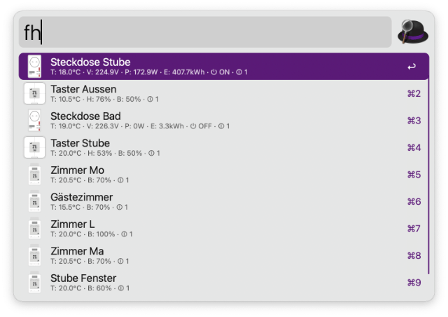
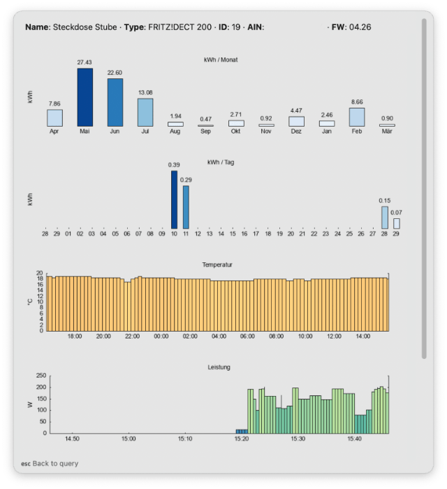

### FRITZ!Box Smart Home Check

An Alfred Workflow (v5.5 or higher) showing information about FRITZ!DECT Smart Home Devices.

1. To generate charts, the installation of **gnuplot** is necessary, and **jq** is required as well. Install **gnuplot** and **jq**, for instance, using **Homebrew**.

2. Configure the Workflow. Set the *Address*, *Username*, and *Password* of your FRITZ!Box, or provide this information in an external file.

3. Optional: Modify translations.

4. Execute the Workflow using `fh` or set your preferred keyword.

5. Choose a device. Press `⌘` (Cmd) for additional details.

6. Press `↩` (Enter) to view charts illustrating temporal trends of temperature, humidity, energy, power, and voltage (depending on the device type).

##### Additional notes

- Only FRITZ!DECT smart home devices are supported.
- The Workflow has been tested with FRITZ!DECT 200, 210, 301, and 440.
- Icons are included for FRITZ!DECT 200, 210, 301, and 440.
- Customization is possible for other FRITZ!DECT devices.
- The script can be modified to alter the appearance of the charts.
