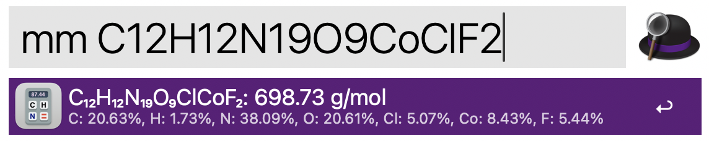

### Molar Mass Calculator
A Python 3 script that calculates the molar mass and mass fractions from an empirical formula.    

1. Run the Molar Mass Calculator keyword (`mm`) or set your own keyword.

2. Type the empirical formula.

3. Press `⏎` (Enter) to copy the results to the clipboard.

