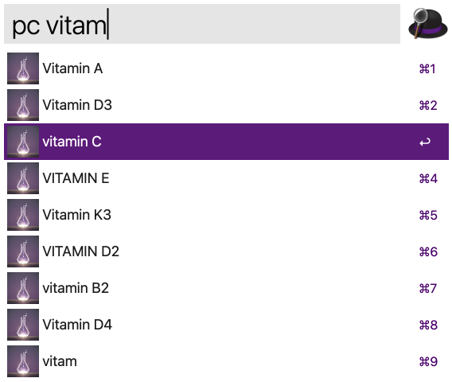
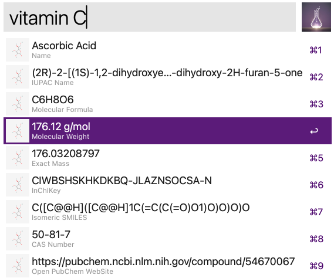
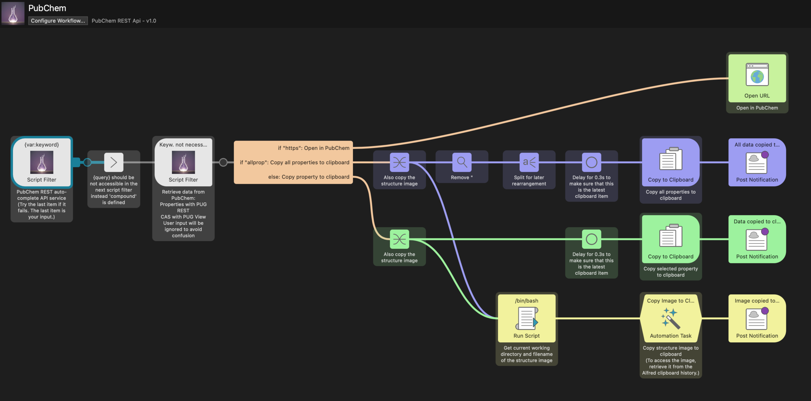

### PubChem Retrieval
An Alfred Workflow that uses the PUG REST, PUG View and Auto-Complete Search Service from 
[PubChem](https://pubchem.ncbi.nlm.nih.gov) for compounds. The installation of **jq** using **Homebrew**, for example, is required.

1. Run the PubChem keyword (`pc`) or set your own keyword.

2.1 Type the full name or part of the name of a compound.

*or*

2.2 Type the `InChIKey` (format: XXXXXXXXXXXXXX-YYYYYYYYYY-Z).

3.1 Select an entry suggestet by the PubChem Auto-Complete Search Service.    

*or*  

3.2 Select the last entry which is the user input (`⌘9`).

*or*

3.3 Select the `InChIKey`.

4. Press `⏎` (Enter).

5. Select one or all of the properties (last entry) or select the web page of the compound (`⌘9`).

    

last entry:

6. Press `⏎` (Enter) to copy the selected property or all properties (last entry) to the clipboard or to open the web page.

An image of the structure will be copied to the clipboard in all cases (except when opening the web page). To access the image, retrieve it from the Alfred clipboard history.

If there are multiple CIDs for one named compound, only the first one will be used for property retrieval.

All densities, melting points, boiling points, CCDC numbers, and COD numbers that are available are listed.

The CAS number is selected from the first available entry in PubChem.

Safety information is selected from the first available entry in PubChem.

#### Workflow:

