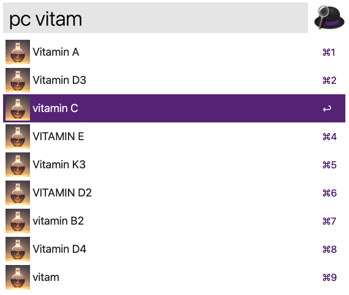
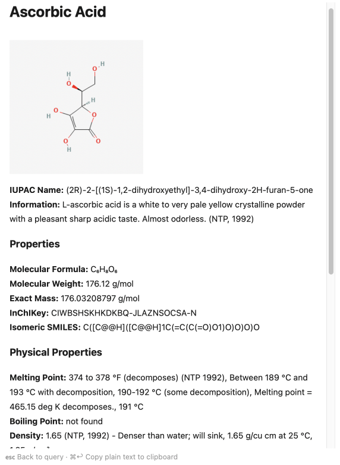

### PubChem Retrieval (v2)
An Alfred (v5.5 or higher) Workflow utilizing the PUG REST, PUG View and Auto-Complete Search Service from 
[PubChem](https://pubchem.ncbi.nlm.nih.gov) for compounds. 

1. Run the PubChem keyword (`pc`) or set your own keyword.

2. a) Type the full name or part of the name of a compound 
*or*   
   b) Type the `InChIKey` (format: XXXXXXXXXXXXXX-YYYYYYYYYY-Z).

3. a) Select an entry suggestet by the PubChem Auto-Complete Search Service 
*or*   
   b) Select the last entry which is the user input (`⌘9`) 
*or*   
   c) Select the `InChIKey`.

4. Press `↩` (Enter).

    

5. a) Select relevant or all properties with `🖱` (Mouse) and copy them to the clipboard with `⌘ c` (Cmd + c)
*or*   
   b) Copy all information as plain text to the clipboard with `⌘ ↩` (Cmd + Enter)
*or*    
   c) Go back to the query with **esc** (Escape)
*or*    
   d) Click on a _link_ to get further information (from PubChem, CAS, COD or CCDC).

##### Additional notes

- If there are multiple CID or CAS numbers for one named compound, only the first one will be used for property retrieval.
- All densities, melting points, boiling points, CCDC numbers, and COD numbers that are available are listed.
- General information is selected from the first available entry in PubChem.
- Safety information is selected from the first available entry in PubChem.
- Alfred 5.5 or higher is required.
